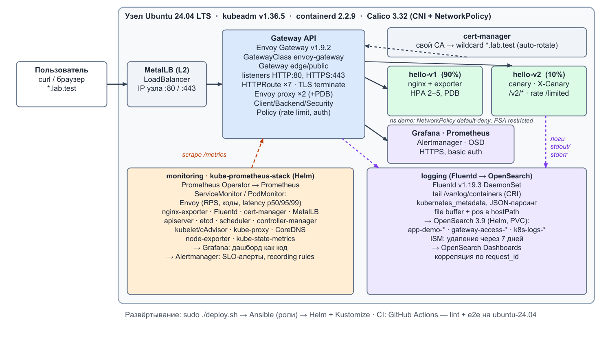
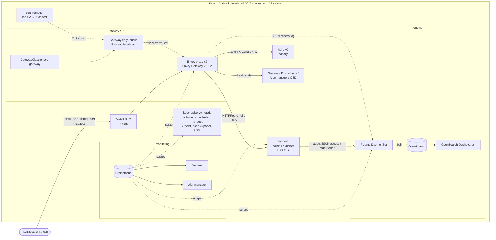

# kube-gateway-lab: Kubernetes (kubeadm) + Gateway API + Prometheus + Fluentd

[](https://github.com/SharPixX/hack/actions/workflows/ci.yml)

Kubernetes-кластер на **kubeadm** разворачивается с нуля одной командой на чистой **Ubuntu 24.04**.
В нём работает демо-приложение (nginx, отвечает `Hello World!`), опубликованное через
**Gateway API** (реализация Envoy Gateway). Вокруг приложения развёрнуты мониторинг
(**Prometheus**, kube-prometheus-stack) и централизованный сбор логов (**Fluentd → OpenSearch**).

```bash
git clone https://github.com/SharPixX/hack.git && cd hack
sudo ./deploy.sh          # ≈12–20 минут (зависит от сети): кластер, платформа, приложение и проверка
```

Последний шаг `deploy.sh` запускает сквозной smoke-test (`make verify`, 56 проверок):
Gateway API, TLS, canary, rate limit, цели и запросы Prometheus, а также доставку конкретного
HTTP-запроса в OpenSearch. Тот же сценарий на каждый push выполняется в GitHub Actions на
раннере **ubuntu-24.04**: два деплоя подряд (проверка идемпотентности), затем smoke-test.
Результат последнего прогона — **56/56 PASS, повторный деплой `changed=0 failed=0`**. Полный вывод:
[`docs/e2e-results.md`](docs/e2e-results.md), прогоны: вкладка [Actions](https://github.com/SharPixX/hack/actions).

---

## Содержание

1. [Архитектура](#1-архитектура)
2. [Технологии и версии](#2-технологии-и-версии)
3. [Требования к среде](#3-требования-к-среде)
4. [Развёртывание](#4-развёртывание)
5. [Проверка приложения и Gateway API](#5-проверка-приложения-и-gateway-api)
6. [Проверка мониторинга](#6-проверка-мониторинга)
7. [Проверка логирования](#7-проверка-логирования)
8. [Автоматизация, идемпотентность, CI/CD](#8-автоматизация-идемпотентность-cicd)
9. [Безопасность и надёжность](#9-безопасность-и-надёжность)
10. [Дополнительные возможности](#10-дополнительные-возможности)
11. [Известные ограничения](#11-известные-ограничения)
12. [Структура репозитория](#12-структура-репозитория)
13. [Удаление и диагностика](#13-удаление-и-диагностика)

---

## 1. Архитектура



<details>
<summary>Та же схема в Mermaid</summary>



</details>

**Поток запроса.** Клиент обращается к `hello.lab.test`. MetalLB анонсирует IP узла для Service
типа LoadBalancer, за которым стоит Envoy. Envoy терминирует TLS, затем по `HTTPRoute`
выбирает backend: 90/10 между v1 и v2, по заголовку или по пути. Запрос попадает в nginx-pod.

**Поток метрик.** Prometheus (Operator) собирает метрики Envoy (RED-метрики по каждому
маршруту), nginx-exporter, Fluentd, cert-manager, MetalLB, Envoy Gateway и всех компонентов
control plane kubeadm. Grafana показывает готовый дашборд, Alertmanager получает алерты.

**Поток логов.** nginx пишет access-лог в JSON в stdout, а error-лог в stderr. Envoy пишет
JSON access-лог. kubelet складывает их в `/var/log/containers`. Fluentd (DaemonSet) читает
файлы, обогащает записи метаданными Kubernetes, парсит JSON и отправляет в OpenSearch по
индексам: `app-demo-*`, `gateway-access-*`, `k8s-logs-*`. Записи Envoy и nginx связаны
общим `request_id` (заголовок `X-Request-Id`).

**Разделение ролей по модели Gateway API.** Платформенная команда владеет `GatewayClass`,
`EnvoyProxy` и `Gateway edge/public`. Команды приложений владеют `HTTPRoute` в своих
namespace. Подключать маршруты к Gateway могут только namespace с меткой
`gateway.lab.test/expose=true` (`allowedRoutes.namespaces.from: Selector`).

## 2. Технологии и версии

Все версии закреплены в одном файле: [`ansible/group_vars/all/versions.yml`](ansible/group_vars/all/versions.yml).

| Компонент | Версия | Как ставится | Назначение |
|---|---|---|---|
| Ubuntu | 24.04 LTS | — | ОС узла (на ней тестировалось, в т.ч. в CI) |
| **Kubernetes (kubeadm, kubelet, kubectl)** | **v1.36.5** | apt `pkgs.k8s.io`, пакеты на hold | Кластер. 1.36 — самая новая minor-версия, которую поддерживает весь стек (Envoy Gateway 1.9: 1.33–1.36, Calico 3.32: 1.34–1.36) |
| containerd / runc / CNI plugins | 2.2.9 / 1.4.3 / 1.9.1 | официальные релизы GitHub, проверка sha256 | Container runtime (systemd cgroups) |
| Calico (tigera-operator) | v3.32.2 | Helm | CNI (VXLAN) + enforcement NetworkPolicy |
| **Envoy Gateway** | **v1.9.2** (Gateway API **v1.6.1**, Envoy 1.39) | Helm (OCI) | **Реализация Gateway API** |
| MetalLB | 0.16.1 | Helm | LoadBalancer для Gateway на bare metal (L2) |
| cert-manager | v1.21.2 | Helm | Собственный CA и wildcard-сертификат `*.lab.test` |
| kube-prometheus-stack | 91.9.0 (Prometheus Operator v0.94.1) | Helm | Prometheus, Alertmanager, Grafana, node-exporter, kube-state-metrics |
| metrics-server | 0.9.0 (chart 3.14.0) | Helm | Resource Metrics API для HPA и `kubectl top` |
| **Fluentd** | **v1.19.3** (`fluent/fluentd-kubernetes-daemonset:v1.19.3-debian-opensearch-1.1`) | Kustomize (свой DaemonSet) | **Сбор логов** |
| OpenSearch / Dashboards | 3.9.0 / 3.9.0 | Helm | Хранение, поиск и просмотр логов |
| local-path-provisioner | v0.0.37 | Kustomize (vendored) | StorageClass по умолчанию (PVC для Prometheus и OpenSearch) |
| nginx (приложение) | 1.30.5 (`nginxinc/nginx-unprivileged:1.30.5-alpine`) | Kustomize | Демо-приложение |
| nginx-prometheus-exporter | 1.5.3 | Kustomize (sidecar) | Метрики nginx |
| Helm | 3.22.0 | бинарник + sha256 | Установка чартов |
| Ansible (ansible-core) | 2.21.4 + kubernetes.core 6.6.0, ansible.posix 2.2.2, community.general 13.4.0 | pip в `.venv` | Оркестрация развёртывания |

**Ресурсы Gateway API:** `GatewayClass`, `Gateway` (2 listener: HTTP:80, HTTPS:443), `HTTPRoute` (7 штук)
с фильтрами `URLRewrite`, `RequestRedirect`, `ResponseHeaderModifier`, weighted `backendRefs`
и `timeouts`. Расширения Envoy Gateway (policy attachment): `EnvoyProxy`, `ClientTrafficPolicy`,
`BackendTrafficPolicy` (retry, circuit breaker, rate limit), `SecurityPolicy` (basic auth).

## 3. Требования к среде

| | Минимум | Рекомендуется |
|---|---|---|
| ОС | Ubuntu 24.04 LTS (server/cloud image), x86_64 или arm64 | чистая ВМ |
| CPU / RAM / диск | 2 vCPU / 8 GiB / 30 GB | 4 vCPU / 8–16 GiB / 40 GB |
| Доступ | root (sudo), выход в Интернет: GitHub, pkgs.k8s.io, registry.k8s.io, Docker Hub, quay.io, Helm-репозитории | |
| Порты узла | свободны 80, 443, 6443, 10250 | |

Docker и пакетный containerd ставить **не нужно**. Если они уже стоят, playbook остановится
с понятной ошибкой: kubeadm-узлу нужен один, управляемый runtime. Ставить вручную Ansible,
Helm или kubectl тоже не нужно, `deploy.sh` всё установит сам.

## 4. Развёртывание

### Одна команда (single-node, рекомендуемый путь)

```bash
git clone https://github.com/SharPixX/hack.git
cd hack
sudo ./deploy.sh            # или: sudo make deploy
```

Что делает `deploy.sh`:

1. **Pre-flight.** Проверяет Ubuntu 24.04, CPU/RAM/диск и свободные порты.
2. **Toolchain.** Создаёт `python3 -m venv .venv` и ставит туда закреплённые `ansible-core` и collections (системный Python не трогается).
3. **`ansible-playbook ansible/site.yml`**:
   - `node_prep`: отключает swap, загружает модули ядра `overlay`/`br_netfilter`, задаёт sysctl (ip_forward, bridge-nf, `vm.max_map_count` для OpenSearch, inotify);
   - `kube_packages`: подключает репозиторий `pkgs.k8s.io` v1.36, ставит kubelet/kubeadm/kubectl `1.36.5` и делает `apt-mark hold`;
   - `containerd`: ставит containerd, runc и CNI plugins из upstream-релизов с проверкой sha256, включает `SystemdCgroup`, берёт sandbox image из `kubeadm config images list`;
   - `control_plane`: выполняет `kubeadm init` по шаблону [`kubeadm-config.yaml.j2`](ansible/roles/control_plane/templates/kubeadm-config.yaml.j2) (API `v1beta4`), только если кластера ещё нет; открывает метрики etcd/scheduler/controller-manager/kube-proxy для Prometheus;
   - `platform`: ставит Calico → local-path → metrics-server → kube-prometheus-stack → MetalLB → Envoy Gateway → cert-manager → Gateway → OpenSearch/Dashboards → Fluentd → приложение → дашборды, алерты и UI-маршруты. Каждый шаг ждёт реальной готовности: `tigerastatus`, `Programmed` у Gateway, `Ready` у Certificate, статусы `HTTPRoute`.
4. **`scripts/smoke-test.sh`** — сквозная проверка (разделы 5–7).
5. **`scripts/show-access.sh`** — выводит адреса и сгенерированные пароли.

Повторный запуск `sudo ./deploy.sh` безопасен: состояние сходится к описанному, ничего не
пересоздаётся (см. [§8](#8-автоматизация-идемпотентность-cicd)).

Полезные цели Makefile: `make help`, `sudo make verify`, `sudo make credentials`, `sudo make ca`,
`sudo make status`, `sudo make destroy`, `make lint`.

### Multi-node (опционально)

```bash
cp ansible/inventory/multinode.example.ini ansible/inventory/multinode.ini   # IP, ssh-пользователь, пул MetalLB
sudo INVENTORY=ansible/inventory/multinode.ini ./deploy.sh
```

Узлы из группы `[workers]` присоединяются через `kubeadm join` с одноразовым токеном (TTL 15 мин).
Для multi-node задайте в `lb_address_pool` отдельный свободный диапазон адресов.

### Как открыть UI с рабочей станции

На самом узле `deploy.sh` уже добавил записи `*.lab.test` в `/etc/hosts`. На своём компьютере
добавьте строку, которую печатает `sudo make credentials`, например:

```
192.168.56.10 hello.lab.test grafana.lab.test prometheus.lab.test alertmanager.lab.test logs.lab.test
```

Затем выполните `sudo make ca` на узле и импортируйте `lab-ca.crt` в браузер (или примите
предупреждение о самоподписанном сертификате).

## 5. Проверка приложения и Gateway API

Все команды выполняются на узле. Gateway получает IP узла (MetalLB), имена резолвятся через `/etc/hosts`.

```bash
sudo make status                                   # узлы, GatewayClass/Gateway/HTTPRoute, поды
kubectl get gatewayclass,gateway -A                # PROGRAMMED=True, ADDRESS=<IP узла>
kubectl get httproute -A

# 1. Основная проверка: HTTP через Gateway API
curl http://hello.lab.test/
# Hello World!

# То же самое без /etc/hosts, напрямую на адрес Gateway
GW=$(kubectl -n edge get gateway public -o jsonpath='{.status.addresses[0].value}')
curl -H 'Host: hello.lab.test' http://$GW/

# 2. HTTPS: сертификат выпущен cert-manager и проверяется собственным CA
sudo make ca && curl --cacert lab-ca.crt https://hello.lab.test/
curl --cacert /opt/kube-gateway-lab/lab-ca.crt https://hello.lab.test/   # тот же CA, сохранён деплоем

# 3. Заголовки ответа: версия backend, pod и фильтр ResponseHeaderModifier
curl -sI http://hello.lab.test/ | grep -Ei 'x-app-version|x-pod|x-served-via'

# 4. Маршрутизация по заголовку (canary) и по пути (с URLRewrite)
curl -H 'X-Canary: always' http://hello.lab.test/info     # {"version":"v2",...}
curl http://hello.lab.test/v1/info                         # {"version":"v1",...}
curl http://hello.lab.test/v2/info                         # {"version":"v2",...}

# 5. Traffic splitting 90/10
for i in $(seq 200); do curl -s http://hello.lab.test/info | jq -r .version; done | sort | uniq -c
#    ~180 v1
#     ~20 v2

# 6. Rate limit (BackendTrafficPolicy, 5 rps на /limited)
for i in $(seq 20); do curl -s -o /dev/null -w '%{http_code}\n' http://hello.lab.test/limited; done | sort | uniq -c

# 7. Редирект HTTP→HTTPS и basic auth для служебных UI
curl -sI http://grafana.lab.test/ | head -3                 # 301 → https://grafana.lab.test/
curl -s -o /dev/null -w '%{http_code}\n' --cacert lab-ca.crt https://prometheus.lab.test/   # 401
```

Таблица маршрутов (`HTTPRoute`):

| Host | Listener | Условие | Backend / действие | Возможность Gateway API |
|---|---|---|---|---|
| hello.lab.test | http, https | header `X-Canary: always` | hello-v2 | HTTPHeaderMatch |
| hello.lab.test | http, https | `PathPrefix /v1`, `/v2` | hello-v1 / hello-v2, префикс срезается | PathPrefix + URLRewrite |
| hello.lab.test | http, https | `PathPrefix /` | hello-v1 **90%** / hello-v2 **10%**, `X-Served-Via`, timeouts | weighted backendRefs, ResponseHeaderModifier, timeouts |
| hello.lab.test | http, https | `PathPrefix /limited` | hello-v1, **5 rps** | BackendTrafficPolicy rateLimit |
| grafana/prometheus/alertmanager/logs.lab.test | http | любой | **301 → https** | RequestRedirect |
| grafana.lab.test | https | любой | Grafana (свой логин) | cross-namespace attachment |
| prometheus / alertmanager / logs.lab.test | https | любой | Prometheus / Alertmanager / OpenSearch Dashboards + **basic auth** | SecurityPolicy |

## 6. Проверка мониторинга

**Что собирается** (Prometheus Operator, всё через `ServiceMonitor`/`PodMonitor`):

| job | Источник | Примеры метрик |
|---|---|---|
| `envoy-gateway-system/envoy-proxy` | Envoy (data plane Gateway) | `envoy_cluster_upstream_rq_total`, `envoy_cluster_upstream_rq_xx{envoy_response_code_class}`, `envoy_cluster_upstream_rq_time_bucket` (latency), `envoy_http_downstream_cx_active` |
| `envoy-gateway` | контроллер Envoy Gateway | xDS, reconcile, watchers |
| `hello` | nginx-prometheus-exporter (sidecar) | `nginx_http_requests_total`, `nginx_connections_active` |
| `logging/fluentd` | Fluentd | `fluentd_output_status_emit_records`, `..._buffer_queue_length`, `..._retry_count`, `..._num_errors` |
| `apiserver`, `kubelet` (+cAdvisor), `kube-etcd`, `kube-scheduler`, `kube-controller-manager`, `kube-proxy`, `coredns` | control plane kubeadm | `apiserver_request_total`, `etcd_server_has_leader`, `container_cpu_usage_seconds_total`, … |
| `node-exporter`, `kube-state-metrics` | узел и объекты k8s | CPU/RAM/диск/сеть узла, `kube_deployment_status_replicas_available` |
| `cert-manager`, `metallb-*` | платформа | срок действия сертификатов, состояние LB |

Готовые артефакты:
- дашборд Grafana **«kube-gateway-lab: Gateway, App & Logging»** (RPS по классам ответов, 5xx ratio, p50/p95/p99 latency, разбивка canary по версиям, CPU/RAM подов, конвейер Fluentd). Генерируется кодом: [`tools/gen-dashboard.py`](tools/gen-dashboard.py);
- recording rules и 9 своих алертов: `HelloUnavailable`, `HelloExporterDown`, `HelloHigh5xxRatio`, `HelloHighLatencyP95`, `GatewayProxyDown`, `GatewayCertificateExpiringSoon`, `FluentdDown`, `FluentdOutputErrors`, `FluentdBufferBacklog` ([`prometheusrule.yaml`](k8s/apps/hello/prometheusrule.yaml), [`platform-rules.yaml`](k8s/observability/platform-rules.yaml)), а также стандартные правила kube-prometheus-stack.

**Как проверить из CLI** (без port-forward, через service proxy API-сервера):

```bash
# здоровье целей: job -> число поднятых таргетов
kubectl get --raw '/api/v1/namespaces/monitoring/services/kps-prometheus:9090/proxy/api/v1/query?query=sum%20by%20(job)%20(up)' | jq -r '.data.result[] | "\(.metric.job)\t\(.value[1])"'

# создать трафик и посмотреть RPS по классам ответа через Gateway
for i in $(seq 50); do curl -s -o /dev/null http://hello.lab.test/; curl -s -o /dev/null http://hello.lab.test/error; done
Q='sum by (envoy_response_code_class) (rate(envoy_cluster_upstream_rq_xx{envoy_cluster_name=~"httproute/demo/.*"}[1m]))'
kubectl get --raw "/api/v1/namespaces/monitoring/services/kps-prometheus:9090/proxy/api/v1/query?query=$(jq -rn --arg q "$Q" '$q|@uri')" | jq .data.result
```

**Через UI.** Откройте `https://prometheus.lab.test` → Status → Targets (логин `admin`, пароль из
`sudo make credentials`) и выполните запрос `sum by (job) (up)`. Ещё вариант:
`https://grafana.lab.test` → Dashboards → *kube-gateway-lab*. Запасной путь без Gateway:
`kubectl -n monitoring port-forward svc/kps-prometheus 9090`.

## 7. Проверка логирования

**Какие логи собираются.** Fluentd (DaemonSet на каждом узле) читает все `/var/log/containers/*.log`
в формате CRI. Каждая запись обогащается полями `kubernetes.namespace_name/pod_name/container_name/labels`.
Логи раскладываются по трём индексам OpenSearch:

| Индекс | Что | Ключевые поля |
|---|---|---|
| `app-demo-YYYY.MM.DD` | **access-лог nginx** (JSON, stdout) и **error-лог nginx** (stderr) | `log_type` (access/error), `status`, `method`, `uri`, `request_time`, `request_id`, `app_version`, `pod`, `log` (текст ошибки) |
| `gateway-access-YYYY.MM.DD` | access-лог Envoy Gateway (JSON) | `authority`, `path`, `response_code`, `duration_ms`, `upstream_cluster`, `route_name`, `request_id` |
| `k8s-logs-YYYY.MM.DD` | все остальные контейнеры | `log`, `stream`, `kubernetes.*` |

Позиции чтения и файловые буферы лежат в `hostPath /var/log/fluentd`, поэтому при рестарте пода
логи не теряются и не дублируются. Для индексов заданы шаблоны с типизированными полями и
политика хранения ISM (удаление через 7 дней). Index pattern в Dashboards создаются автоматически.

**Проверка: запрос → запись в логах** (именно это делает smoke-test):

```bash
M="probe$(date +%s)"
curl -s "http://hello.lab.test/?probe=$M"                      # access-лог
curl -s "http://hello.lab.test/stub_status?probe=$M"           # 403 → строка в error-логе nginx
sleep 15
OS=/api/v1/namespaces/logging/services/opensearch-cluster-master:9200/proxy
kubectl get --raw "$OS/app-demo-*/_search?q=uri:*$M*" | jq '.hits.hits[0]._source | {"@timestamp", log_type, method, uri, status, app_version, pod}'
kubectl get --raw "$OS/app-demo-*/_search?q=log_type:error%20AND%20$M" | jq -r '.hits.hits[0]._source.log'
kubectl get --raw "$OS/gateway-access-*/_search?q=$M" | jq '.hits.hits[0]._source | {authority, path, response_code, upstream_cluster, request_id}'
kubectl get --raw "$OS/_cat/indices?v"
```

**Через UI.** Откройте `https://logs.lab.test` (OpenSearch Dashboards, basic auth) → Discover →
index pattern `app-demo-*` (выбран по умолчанию) и выполните запрос `uri:*probe*` или `log_type:error`.

## 8. Автоматизация, идемпотентность, CI/CD

- **Одна точка входа:** `sudo ./deploy.sh`. Ручного создания или редактирования ресурсов Kubernetes нет.
- **Декларативность.** Конфигурация хранится в Git: Helm values ([`platform/`](platform)), Kustomize ([`k8s/`](k8s)), Ansible-роли ([`ansible/roles`](ansible/roles)). Версии и sha256 бинарников собраны в одном файле.
- **Идемпотентность:**
  - `kubeadm init/join` выполняется только при отсутствии `/etc/kubernetes/admin.conf` / `kubelet.conf`;
  - Helm-релизы ставятся через `kubernetes.core.helm`: модуль сравнивает версию чарта и values, при совпадении ничего не делает;
  - манифесты применяются `kubectl apply -k`, а `changed` вычисляется по выводу (`unchanged`);
  - секреты генерируются один раз (lookup `password` в `/etc/kube-gateway-lab`, режим 0600) и при повторе не меняются;
  - CI запускает деплой **дважды подряд** на одной машине и прогоняет smoke-test после второго запуска.
- **CI ([`.github/workflows/ci.yml`](.github/workflows/ci.yml)):**
  1. `lint`: yamllint, shellcheck, ansible-lint (profile *production*), `helm template` всех чартов с нашими values, `kustomize build` + **kubeconform -strict** по схемам Kubernetes **и схемам, сгенерированным из CRD закреплённых версий чартов** ([`tools/crd2schema.py`](tools/crd2schema.py)): опечатка в поле `HTTPRoute` или `BackendTrafficPolicy` валит сборку; `nginx -t` и `fluentd --dry-run` внутри тех же образов, что работают в кластере; gitleaks по всей истории Git (секреты); trivy config (мисконфигурации, отчёт);
  2. `e2e`: на чистом раннере **ubuntu-24.04** выполняются `deploy.sh` → повторный `deploy.sh` → `smoke-test.sh`. Итог попадает в Job Summary, полная диагностика (поды, события, таргеты Prometheus, индексы OpenSearch, логи) сохраняется как artifact.

## 9. Безопасность и надёжность

- **Нет секретов в Git.** Пароли Grafana и basic auth генерируются при деплое и лежат только на control-plane узле (`/etc/kube-gateway-lab`, 0700). TLS-ключи выпускает cert-manager внутри кластера. В CI работает gitleaks.
- **Цепочка поставки.** Бинарники проверяются по sha256, все образы и чарты закреплены по версиям, `latest` нигде не используется (busybox у local-path и OpenSearch тоже закреплён).
- **Pod Security Admission** на уровне namespace: `restricted` для `demo`, `edge` и `cert-manager`, `baseline` для data plane Envoy, `privileged` только для node-агентов (CNI, MetalLB speaker, node-exporter, Fluentd).
- **Приложение:** non-root (UID 101), `readOnlyRootFilesystem`, `drop: [ALL]`, seccomp `RuntimeDefault`, без токена ServiceAccount, requests/limits, liveness/readiness, `preStop` для корректного drain.
- **NetworkPolicy (Calico).** В `demo` запрещено всё, кроме трафика от Envoy Gateway на 8080 и от Prometheus на 9113. Egress закрыт.
- **Gateway:** TLS ≥ 1.2, HTTPS-only для служебных UI, basic auth (`SecurityPolicy`), отказ на заголовки с `_` (защита от header smuggling), таймауты запросов, retry с backoff, circuit breaker, rate limit.
- **Отказоустойчивость:** 2 реплики Envoy + PDB, HPA для v1 (2–5 подов) + PDB, rolling update с `maxUnavailable: 0`, topology spread. Метрики control plane открыты так, что `/metrics` controller-manager и scheduler по-прежнему требуют authn/authz.

## 10. Дополнительные возможности

| Что | Где | Как проверить |
|---|---|---|
| TLS-терминация на Gateway, собственный CA через cert-manager, автоматическая ротация (90 дней / за 15 дней) | `k8s/gateway/pki.yaml`, `gateway.yaml` | `curl --cacert lab-ca.crt https://hello.lab.test/` |
| Traffic splitting 90/10 (canary) | `k8s/apps/hello/routes.yaml` | цикл из §5 |
| Маршрутизация по заголовку, по пути + URLRewrite, по hostname (5 хостов) | `routes.yaml`, `ui-routes.yaml` | §5 |
| Редирект HTTP→HTTPS (RequestRedirect) | `k8s/gateway/https-redirect.yaml` | `curl -I http://grafana.lab.test` |
| Rate limiting, retries, circuit breaker | `traffic-policies.yaml` | цикл `/limited` → 429 |
| Basic auth на Gateway (SecurityPolicy), пароли генерируются | `ui-routes.yaml` | 401 без пароля, 200 с паролем |
| Публикация Grafana, Prometheus, Alertmanager и OpenSearch Dashboards через тот же Gateway (cross-namespace) | `ui-routes.yaml` | `https://*.lab.test` |
| HTTP RED-метрики (RPS, коды ответов, latency p50/95/99) из Envoy + метрики nginx, CPU/RAM | PodMonitor/ServiceMonitor | дашборд Grafana |
| Метрики control plane kubeadm (etcd, scheduler, controller-manager, kube-proxy) | `kubeadm-config.yaml.j2` | `up{job=~"kube-.*"}` |
| Свой дашборд Grafana как код + алерты и recording rules | `tools/gen-dashboard.py`, `*rule*.yaml` | Grafana, `/alerts` |
| Централизованное хранение и поиск логов, корреляция Gateway↔App по `request_id`, ISM retention 7d | OpenSearch, `logging.yml` | §7 |
| Метрики самого конвейера логов + алерты на него | Fluentd PodMonitor | `fluentd_output_status_*` |
| CI: строгая валидация по CRD-схемам, e2e на Ubuntu 24.04, проверка идемпотентности | `.github/workflows/ci.yml` | вкладка Actions |
| HPA, PDB, NetworkPolicy, PSA, non-root/read-only контейнеры | `k8s/apps/hello` | `kubectl -n demo get hpa,pdb,netpol` |
| Multi-node через inventory (kubeadm join) | `ansible/inventory/multinode.example.ini` | §4 |

## 11. Известные ограничения

- **Single-node по умолчанию.** Это лабораторный стенд: control plane не HA (одна etcd), данные Prometheus и OpenSearch лежат на local-path (диск узла). Multi-node реализован, но в CI проверяется только single-node.
- **MetalLB отдаёт Gateway IP самого узла** (`lb_address_pool = <node-ip>/32`), поэтому порты 80/443 узла должны быть свободны. В сети с несколькими узлами нужен отдельный пул (`-e lb_address_pool=…`).
- **Security plugin OpenSearch отключён.** API OpenSearch доступен только внутри кластера (ClusterIP), Dashboards закрыты basic auth на Gateway. Для production: security plugin + TLS + OIDC/RBAC, отдельные учётки для Fluentd.
- **metrics-server с `--kubelet-insecure-tls`:** у kubelet в kubeadm самоподписанные serving-сертификаты. Для production нужны `serverTLSBootstrap: true` и kubelet-csr-approver.
- **Метрики etcd** (`:2381`, HTTP) и kube-proxy (`:10249`) слушают на IP узла. Доступ к ним нужно ограничивать firewall'ом / security group.
- **Basic auth** — простая защита для лаборатории. Для production — OIDC (`SecurityPolicy.oidc`) или внешний IdP.
- **Rate limit локальный** (на каждую реплику Envoy). Глобальный лимит требует Redis и ratelimit-сервиса Envoy Gateway.
- **CRD и Helm.** Helm не обновляет CRD при `upgrade`, поэтому смена версий чартов с новыми CRD требует `kubectl apply --server-side` CRD (обычная практика для Helm).
- Нужен доступ в Интернет (registry, GitHub, Helm-репозитории). Для air-gapped установки нужен локальный registry/mirror.
- `deploy.sh` рассчитан на запуск от root (`sudo`): ставит пакеты и меняет системные настройки узла.

## 12. Структура репозитория

```
deploy.sh                    единая точка входа (pre-flight → toolchain → ansible → smoke test)
Makefile                     deploy / verify / credentials / ca / status / destroy / lint
ansible/
  site.yml, reset.yml        развёртывание и teardown
  group_vars/all/versions.yml все версии + sha256 (единый источник правды)
  group_vars/all/main.yml    CIDR, домен, пул MetalLB и т.д.
  inventory/                 local.ini (single node), multinode.example.ini
  roles/node_prep            swap, модули ядра, sysctl, пакеты
  roles/kube_packages        pkgs.k8s.io, kubelet/kubeadm/kubectl (hold)
  roles/containerd           containerd + runc + CNI plugins (upstream, sha256)
  roles/control_plane        kubeadm init (v1beta4 config), kubeconfig
  roles/worker               kubeadm join
  roles/helm                 helm binary
  roles/platform             Helm-релизы, Kustomize, ожидания готовности, bootstrap OpenSearch
platform/*.yaml              Helm values всех чартов
k8s/
  namespaces/                namespaces + Pod Security + метка доступа к Gateway
  gateway/                   GatewayClass, EnvoyProxy, Gateway, PKI, редирект, ClientTrafficPolicy
  apps/hello/                приложение (base + variants v1/v2), HTTPRoutes, policies, NetworkPolicy, мониторинг
  logging/                   Fluentd: конфиг, DaemonSet, RBAC, PodMonitor
  observability/             PodMonitor/ServiceMonitor, алерты, дашборд, UI-маршруты + SecurityPolicy
  platform/local-path-storage vendored local-path-provisioner + патчи
scripts/                     smoke-test, show-access, lint, collect-diagnostics
tools/                       генератор дашборда, CRD → JSON schema
.github/workflows/ci.yml     lint + e2e на ubuntu-24.04
docs/                        паспорт решения
```

## 13. Удаление и диагностика

```bash
sudo make destroy               # kubeadm reset + очистка CNI/iptables/hosts; пакеты и пароли сохраняются
sudo ./deploy.sh                # после destroy кластер можно развернуть заново
sudo make diagnostics           # срез состояния кластера в ./diagnostics (без содержимого секретов)
sudo ANSIBLE_ARGS="--tags platform" ./deploy.sh   # переприменить только платформу и приложение
```

---

Решение подготовлено для онлайн-этапа хакатона по DevOps. Паспорт решения: [`docs/passport`](docs/passport).
